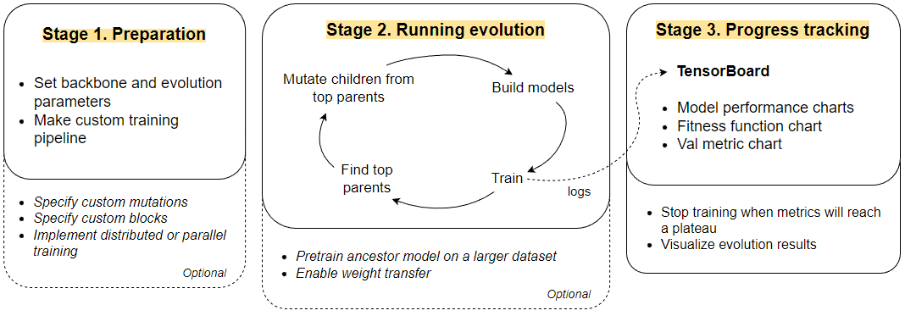
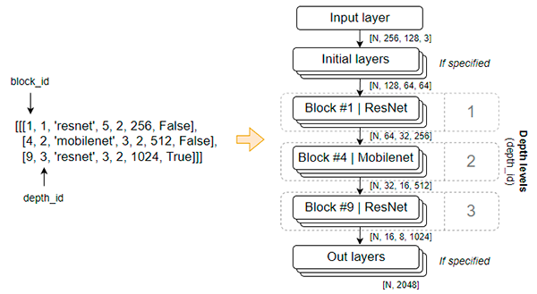
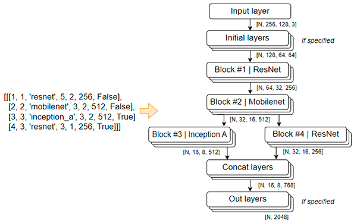
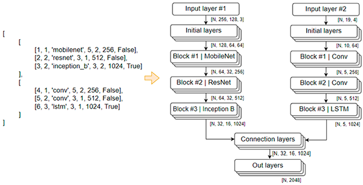
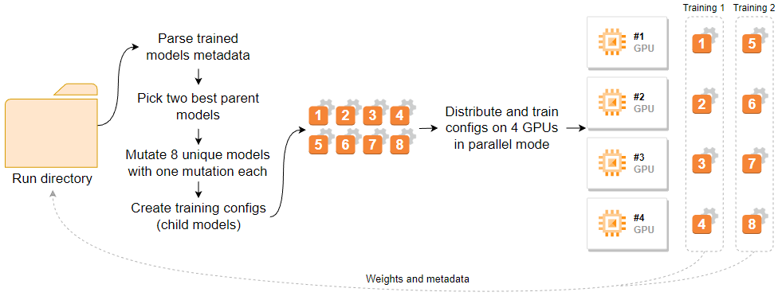
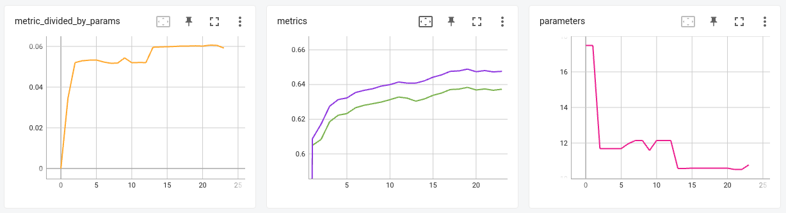
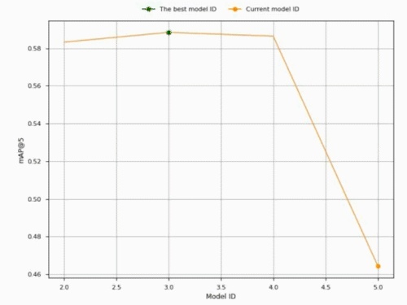

# Making your first evolution with Evolly

Evolly was designed as a flexible framework with ability to be integrated 
in any DL pipeline. 

Complete following steps to boost your model's accuracy:  

1. Create config file
2. Create model building pipeline
3. Create training pipeline
4. Run evolution

Let's assume that our goal is to build a classification model for 
[Fashion MNIST](https://github.com/zalandoresearch/fashion-mnist) dataset.

We included [Tensorflow and PyTorch code examples](examples) below to get you familiar with Evolly.

NOTE: We've fully tested only Tensorflow blocks of the Evolly. 
Torch blocks may have some bugs.  

## 1. Create config file

It's highly recommended to use [yacs](https://github.com/rbgirshick/yacs) 
config for storing project settings. 

Following variables should be used in your training pipeline:

| Variable name                | Purpose                                                                   | Required |
|------------------------------|---------------------------------------------------------------------------|----------|
| `cfg.genotype.branches`      | Backbone architecture (genotype)                                          | +        |
| `cfg.genotype.branch_names`  | Names of corresponding branches                                           | +        |
| `cfg.train.epochs`           | Number of epochs to train model                                           | +        |
| `cfg.train.accelerators`     | List of accelerators which would be used during training                  | +        |
| `cfg.train.accelerator_type` | Type of the accelerators: 'GPU' / 'CPU' / 'TPU'                           | +        |
| `cfg.train.save_dir`         | Path to directory where weights and metadata will be saved after training | +        |
| `cfg.model.name`             | Name of weights and metadata files (without format)                       | +        |
| `cfg.val.metric_op`          | Whether to maximize ('max') or minimize ('min') target metric             | +        |
| `cfg.model.generation_id`    | Generation ID of the model (used for making cfg.model.name)               | +        |
| `cfg.model.model_id`         | Model identifier (used for making cfg.model.name)                         | +        |
| `cfg.model.parent_id`        | Parent's Model ID                                                         | -        |
| `cfg.model.parent`           | Path to the parent's weights                                              | -        |

Backbone architecture must be stored in a `cfg.genotype.branches` variable as a list of branches:

[branch1, branch2, ..., branchN], where each branchN is a list of branch blocks.

Each block is a list of its parameters:

[block_id, depth_id, block_type, kernel_size, strides, filters_out, dropout]

Example of config file [you can find here](examples/tf_examples/classification/cfg.py).

## 2. Create model building pipeline

It's also recommended to create a standalone `.py` file with a model building.

Inside that file unpack genotype with `unpack_genotype` function, 
then call `build_model` function to create a model.

Evolly parses genotype and builds model object with respect to specified arguments 
of `build_model` function, such as:
* Desired framework - Tensorflow or PyTorch
* Custom initial layers
* Activation function that will be used in each block
* Whether to use default or custom head layers:
    * There are 3 default heads: classification, pose estimation, embedding
    * Or you can pass your own custom head for solving another task

**Backbone consisting of 3 blocks**.

**Backbone with two blocks on third depth level**. You can specify multiple blocks in the same depth level. 
Outputs of these blocks will be concatenated by filters dimension.

**Backbone with two branches**. Outputs of multiple branches will be connected 
after the last block of each branch.

Created model is a [tf.keras.Model](https://www.tensorflow.org/api_docs/python/tf/keras/Model) or 
[torch.nn.Module](https://pytorch.org/docs/stable/generated/torch.nn.Module.html) object of Tensorflow or 
PyTorch framework respectively. You can utilize it in your training further.

Examples: [Tensorflow](examples/tf_examples/classification/create_model.py) /
[PyTorch](examples/torch_examples/classification/create_model.py)

## 3. Create training pipeline

With a created model object you can design any training process. 
You should only make a wrapper function that will:

1. Take config as input
2. Build model from genotype
3. Train model
4. Compute fitness value
5. Write training logs to metadata dict
6. Save weights and metadata

Weights transfer can be implemented between parent and child model. 
We would recommend utilizing it only if you want to tune backbone.
Our experiments showed that usage of weights transfer with a 4 epochs 
per training isn’t enough to teach blocks that were initialized with random weights. 
4 epochs is enough only for training existing parent’s blocks with new configuration 
(mutated kernel size, strides, filers or dropout).

Examples: [Tensorflow](examples/tf_examples/classification/train.py) /
[PyTorch](examples/torch_examples/classification/train.py)

Advanced Tensorflow example _(will be added soon)_

Metadata file must have `.json` format and following structure:

| Key             | Description                    | Data type      |
|-----------------|--------------------------------|----------------|
| `train_loss`    | Train loss of each epoch       | List of floats |
| `val_metric`    | Validation loss of each epoch  | List of floats |
| `config`        | Yacs config dump               | Dictionary     |
| `parameters`    | Model parameters               | Int            |
| `flops`         | Model flops                    | Int            |
| `training_time` | Total training time in seconds | Float          |
| `fitness`       | Model fitness value            | Float          |

[Metadata json example](examples/0000_00001_0.90547_meta.json).

## 4. Run evolution

Scheme of the evolution cycle (one generation) with:
two parents, four children, four GPUs and enabled parallel training mode:

Running evolution starts from creating a script where you need to:

* Import training wrapper function, config, Evolly's `Evolution` class and 
specify accelerators which will be used during evolution
* Define evolution parameters
* Start infinite evolution cycle with `Evolution.start` method

[Backbone tuning Tensorflow example](examples/tf_examples/classification/backbone_tuning.py) 
/ [Backbone search PyTorch example](examples/torch_examples/classification/backbone_search.py)

Then start TensorBoard process with `tensorboard --logdir PATH_TO_LOGS_DIR --port=6006` 
in a separate terminal.

NOTE: If you are launching Evolly on cloud machine, don't forget to forward TensorBoard port. 
Add `-L 6006:localhost:6006` to your connection command. For example:

`ssh -p SERVER_PORT USERNAME@HOST_IP -L 6006:localhost:6006`

After that you can access the TensorBoard console in browser: http://localhost:6006

As soon as fitness metric stops increasing, you can stop evolution by killing process or 
pressing Ctrl + C if you are running it in terminal window.

# Analyzing results

When evolution is finished you can utilize `analyze_runs` and `visualize_run` functions
to find "the best" model and visualize progress:

`from evolly import analyze_runs` 

and

`from evolly import visualize_run`

Examples:
* [Finding "the best" model and building plots](examples/build_plots.py) - making matplotlib plots 
and saving them as image.
* [Visualizing evolution](examples/visualize_run.py) - making video with evolution progression
