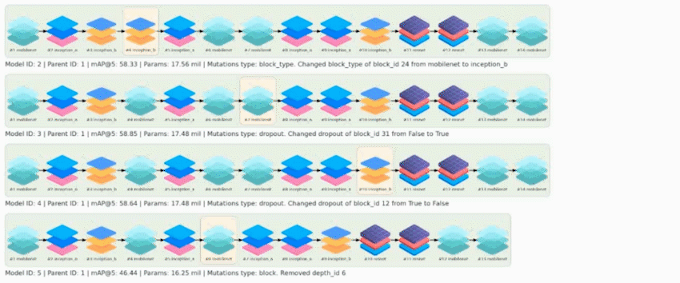

**Evolly** is an [evolutionary](https://en.wikipedia.org/wiki/Evolutionary_algorithm) 
[neural architecture search](https://en.wikipedia.org/wiki/Neural_architecture_search) 
framework designed to make running evolution as flexible as possible.

Learn details of the Evolly's pipeline in our [Medium post](https://medium.com/@RevisorTeam/evolutionary-framework-for-searching-backbone-architecture-evolly-f568383ced51).

## What does Evolly do?

Evolly allows you to:
1. **Boost metrics of your deep learning model** by tuning backbone 
architecture
2. **Search for new backbone architectures** by finding optimal types, 
order of the blocks and optimizing block parameters (kernel sizes, strides, filters and dropouts).

You can apply it with to any Deep Learning task:
classification, detection, segmentation, pose estimation, GAN, etc. 

## Features

We've added following features to make it possible to implement Evolly 
in any training pipeline:

* Build models using common DL frameworks (tensorflow, torch)
* Set multiple branches (stems) of different data types
* Define custom backbone depth and width
* Pass custom architecture blocks
* Choose parameters to mutate
* Customize allowed values and intervals of the mutations
* Run training in distributed or parallel mode
* Monitor evolution via TensorBoard
* Estimate search space size
* Visualize evolution

## Getting started

To launch evolution with Evolly:

1. Install Evolly via pip: ``pip install evolly[tensorflow,torch]``. 
If tensorflow (>=2.3) and torch (>=1.9.0) have already been installed, you can install Evolly using: ``pip install evolly`` 
2. Follow [Making your first evolution](GETTING_STARTED.MD) guide.

## Usage examples
| Link     | Features                                                                                                                                            | Task             | Complexity | Framework   | Data   |
|----------|-----------------------------------------------------------------------------------------------------------------------------------------------------|------------------|------------|-------------|--------|
| **[#1]** | Simple Tensorflow training, backbone tuning                                                                                                         | Classification   | Easy       | Tensorflow  | Images |
| **[#2]** | Simple PyTorch training, backbone search                                                                                                            | Classification   | Easy       | PyTorch     | Images |
| **[#3]** | Custom training pipeline and losses, mixed precision, parallel and distributed training support, TPUs support, backbone search with weight transfer | Image retrieval  | Advanced   | Tensorflow  | Images |

[#1]: examples/tf_examples/classification/
[#2]: examples/torch_examples/classification/
[#3]: examples/tf_examples/image_retrieval/

## Improvements

We are open to any help. Check out [our ideas here](https://medium.com/@RevisorTeam/evolutionary-framework-for-searching-backbone-architecture-evolly-f568383ced51) to learn how we can upgrade Evolly together:

- [x] Test default PyTorch blocks
- [x] Add more usage examples
- [ ] Add new data types
- [ ] Add new default blocks
- [ ] Additional parameters to mutate
- [ ] Utilize [mutation rate](https://en.wikipedia.org/wiki/Mutation_rate) and add mutation probabilities
- [ ] Implement reinforcement learning
- [ ] Upgrade branch connections
- [ ] Implement ability to build multiple branches with torch

## References

* [EvoPose2D](https://www.researchgate.net/publication/355101183_EvoPose2D_Pushing_the_Boundaries_of_2D_Human_Pose_Estimation_Using_Accelerated_Neuroevolution_With_Weight_Transfer): genotype storing approach and MobileNetV2 block implementation
* [Inception_ResNet_v2](https://github.com/Sakib1263/Inception-InceptionResNet-SEInception-SEInceptionResNet-1D-2D-Tensorflow-Keras) block implementation
* [ResNet](https://github.com/keras-team/keras/blob/master/keras/applications/resnet.py) block implementation

## Contacts

Contact us if you are interested in collaborating or ready to invest 
in us: revisorteam@pm.me
