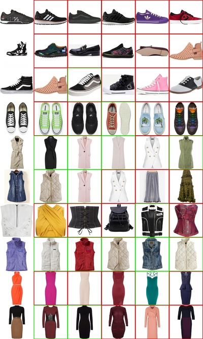

# Searching for optimal backbone architecture to retrieve images 

Here is an example of making custom Tensorflow training pipeline and implementing 
Evolly to search for an optimal image retrival backbone.

This pipeline was also used to find a model that has 4x times fewer training 
parameters than SOTA. We've launched it on a large scale image 
retrival dataset (millions of samples).

Parallel and distributed training was tested on machines with 2x - 10x RTX 4090.
Tests showed that it's better to use machine with 4x RTX 4090 and launch 
Evolly in parallel training mode 
*(accelerators_per_cfg=1, parallel_training=True)*. 

## Dataset

[Polyvore](https://github.com/xthan/polyvore-dataset) clothing dataset 
was used in demonstration purposes. 
It has labelling bugs (multiple category_id may be used to label 
the same clothing type) and imbalanced number of samples per category.

Following example shows that model returns positive samples from gallery 
(first column is query images, other columns - gallery images), 
but their labels was set to another category_id in 
the dataset which generates negative results (marked with a red color).

We recommend you to re-label this dataset or use it for tests only. 
You can also utilize your own dataset - in order to do this, you need to 
update `dataset/make_tfrecords.py` and `dataset/dataloader.py` scripts.

## How to launch?

1. Download Polyvore outfits dataset ([from here](https://www.kaggle.com/datasets/dnepozitek/polyvore-outfits) or 
[here](https://drive.google.com/file/d/13-J4fAPZahauaGycw3j_YvbAHO7tOTW5/view?usp=sharing))
and extract it. 
2. Specify path to extracted dataset in the `dataset/make_tfrecords.py` script (`images_path` and `json_path` variables), then launch it.
3. Update following variables in the `cfg.py`:
   * `cfg.dataset.tfrecords` *(if you've changed it in `make_tfrecords.py`)* - path to directory with dataset splits. Each split contains tfrecord files.
   * `cfg.dataset.batch_size` - number of samples in batch depends on GPU VRAM volume. 128 set for the 12 GB VRAM GPU.
   * `cfg.genotype.branches` - model that is specified here is quite simple (5.7 mil params). You can add more blocks to it in order to increase its complexity.  
4. In the `backbone_search.py` script specify `parallel_training` variable - set to True if your machine has more than one accelerator (GPU / TPU).
5. Launch `backbone_search.py` and follow [Getting started guide](https://github.com/RevisorTeam/evolly/blob/main/GETTING_STARTED.MD) (from step 4).
6. As soon as evolution is ended, and you have chosen the best model, you can utilize following scripts:
   * `evaluate.py` - to compute classification and retrieval metrics of trained model. 
   * `retrieve_samples.py` - to visualize gallery samples retrieval for each query sample.  
   * `calibrate.py` - to find optimal distance threshold (to decide which retrieved samples are Positive 
and which are Negative).

